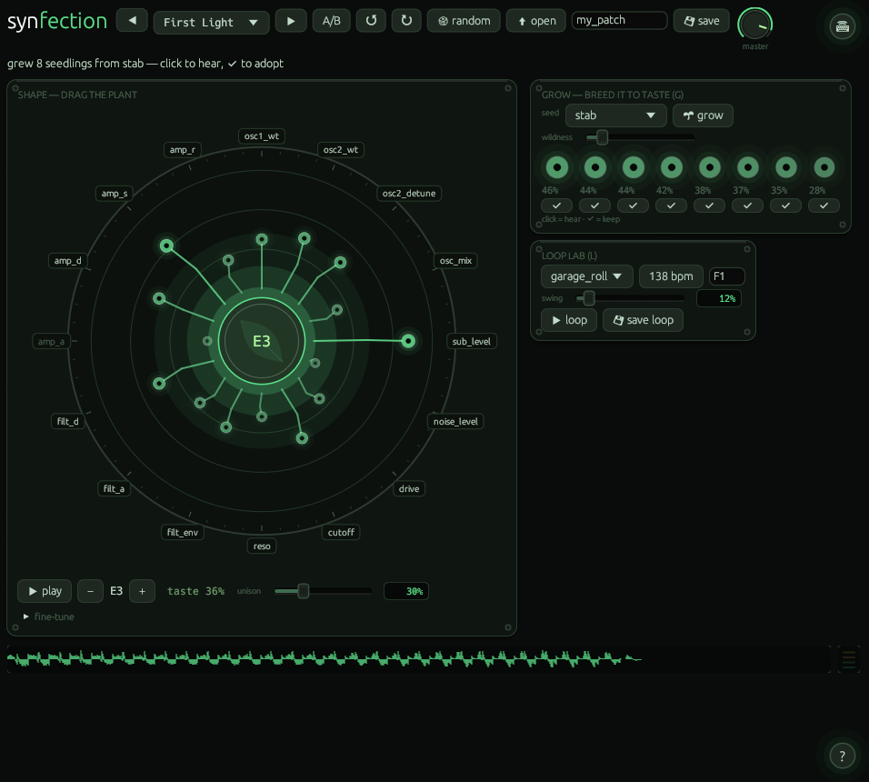
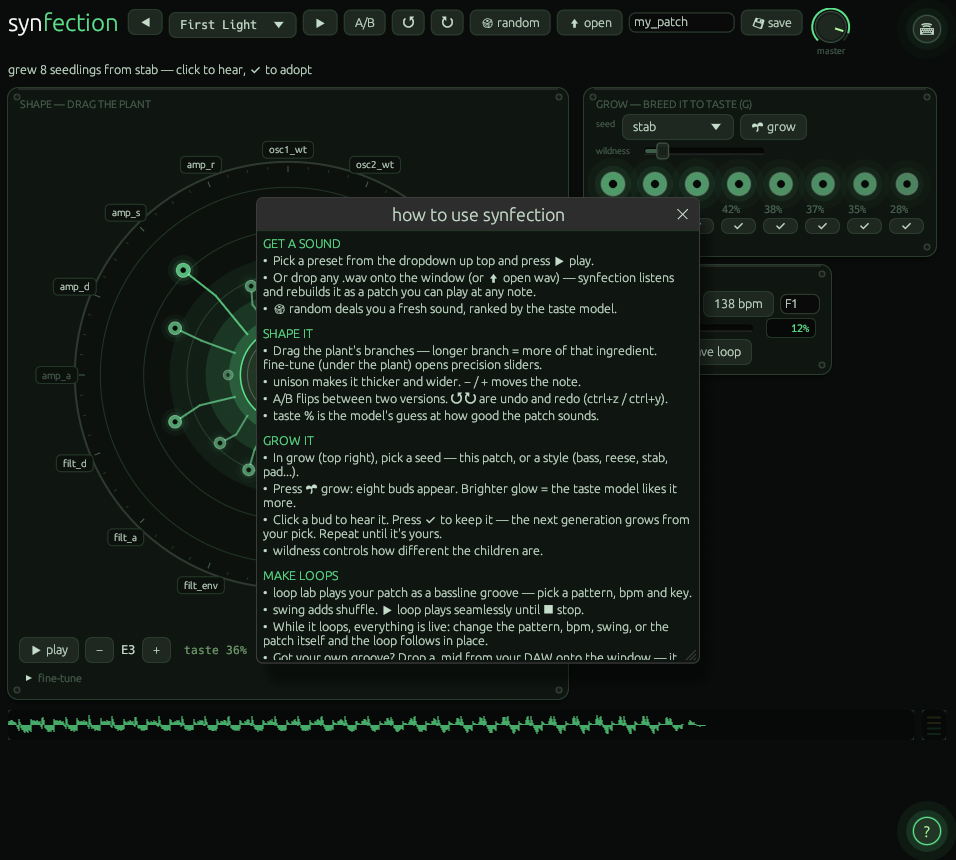

# synfection 🧬

**Hear a sound. Grow it. Play it.**

Drop any sound into synfection and it grows a synth patch that plays it back —
then lets you thicken it, breed it into something new, and turn it into
club-ready loops. One small app. No install, no plugins, no accounts.

The brain taught itself: it learned to reverse-engineer synth patches by
listening to **192,000 sounds it rendered for itself** — then learned what
*sounds good* from a working DJ's star-ratings. No other freeware
sound-matcher ships with an actual ear.

## What it does

- 🎧 **Clone a sound** — drop a `.wav` on the window. A neural network listens,
  works out the recipe, and hands you a patch you can play at any note.
- 🌱 **Grow it to taste** — the garden breeds eight variations at a time. Buds
  that glow brighter are ones the built-in taste model predicts you'll love.
  Click to hear, ✓ to keep, repeat until it's *yours*.
- 🔊 **Make it thick** — a one-knob unison spreads your patch across detuned
  voices for that wide, expensive sound.
- 🥁 **Make loops** — twelve bassline grooves (UK garage, speed garage, bass
  house, drum & bass) with adjustable swing — or drop a `.mid` from your DAW
  and loop *your own* groove. Everything is live: change the pattern, tempo,
  or the patch itself while it loops and it follows in place. Loops save as
  ready-to-use `.wav` files.
- 💾 **Keep everything** — name a patch, save it, and it's in your library
  every time you open the app. Patches are tiny text files you can back up or
  share.
- 🛡️ **Stay safe** — everything you hear or save passes through a built-in
  limiter and loudness guard. No experiment can clip your speakers or hurt
  your ears.

Stuck? The **?** button in the bottom corner explains everything in one page.

## Download

Grab your platform from [**Releases**](https://github.com/juxstin1/synfection/releases/latest) — one file, double-click, done:

| | |
|---|---|
| **Windows** | `synfection-windows-x86_64.exe` |
| **macOS** (M1/M2/M3/M4) | `synfection-macos-arm64` |
| **macOS** (Intel) | `synfection-macos-x86_64` |
| **Linux** | `synfection-linux-x86_64` |

macOS / Linux: run `chmod +x synfection-*` once. macOS will block the first
launch (it's an unsigned indie binary) — the quick fix is
`xattr -d com.apple.quarantine synfection-*` in Terminal, or launch it once,
then allow it under **System Settings → Privacy & Security → Open Anyway**.
(Right-click → Open no longer works on macOS 15+.)

## Your first five minutes

1. Open it. Press **▶ play** — that's the *First Light* preset.
2. Browse presets with **◀ ▶**: garage stabs, an organ bass, a slow-blooming
   long stab, a deep sub, a reese growl, an acid squelch...
3. Drag a **branch of the plant** and play again. Longer branch = more of that
   ingredient.
4. In the **garden**, press **🌱 grow**. Click buds to hear them; press **✓**
   under your favorite. Do it a few times — you're breeding a sound.
5. In the **loop lab**, pick `speed_walk`, set your BPM, press **▶ loop**.
6. Love it? Type a name, hit **💾 save**. It's yours forever, under
   *YOUR PATCHES* in the dropdown.

Got a sound you wish you could play? Drop the `.wav` straight onto the window —
an isolated bass or lead (a one-shot, or a stem) works best.

## The sounds it knows

The synth inside is a 16-ingredient recipe: two morphing wavetable oscillators,
a sub, shaped noise, drive, a resonant filter, and full envelopes. The neural
network taught itself to reverse-engineer that recipe by listening to
**192,000 sounds it rendered for itself** — every bass, stab, and pluck the
engine can make.

On top of that sits a **taste model trained on real star-ratings from a working
DJ** — hundreds of patches rated by ear across seven families: deep subs,
reese growls, leads, plucks, stabs, pads, and keys. That's what makes the
garden's buds glow and the 🎲 random button deal you *good* hands instead of
noise. Most generative tools aim for the statistical average; synfection has
one specific person's taste baked in — it suggests what *he'd* keep, not what's
merely plausible.

## Built-in safety

Sound design tools can screech. synfection can't: every patch, loop, and
experiment is peak-limited, loudness-guarded, and de-clicked before it reaches
your ears or your files. Turn the wildness up — the output stays civilized.

## For the curious

The same binary is a full command line tool (`synfection --help`): clone,
render, breed, and batch-generate loops from scripts. The machine-learning lab
that trains the models lives in [`lab/`](lab/) with its own
[research notes](docs/LAB.md) — PyTorch training, the rating pipeline, and the
export path that bakes the network into the app.

The Rust engine is verified **sample-for-sample against the PyTorch reference
in CI** — the binary you download renders bit-honest to the research code that
trained the models.

## License

MIT — free to use, free to share.
